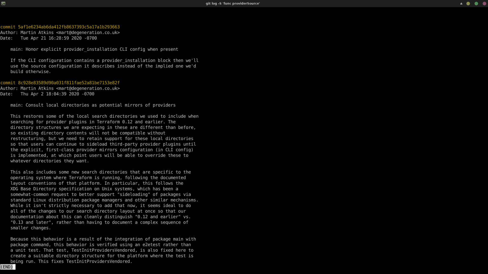

# Домашнее задание к занятию "`Инструменты Git`" - `Живарев Игорь`


---

### Задание 1


# Найдите полный хеш и комментарий коммита, хеш которого начинается на 'aefea'.

```
─shaman@Barton ~/git/terraform ‹main●› 
╰─$ git log aefea

commit aefead2207ef7e2aa5dc81a34aedf0cad4c32545
Author: Alisdair McDiarmid <alisdair@users.noreply.github.com>
Date:   Thu Jun 18 10:29:58 2020 -0400

    Update CHANGELOG.md


```


# Какому тегу соответствует коммит `85024d3`?

```
╭─shaman@Barton ~/git/terraform ‹main●› 
╰─$ git log 85024d3

commit 85024d3100126de36331c6982bfaac02cdab9e76 (tag: v0.12.23)
Author: tf-release-bot <terraform@hashicorp.com>
Date:   Thu Mar 5 20:56:10 2020 +0000

    v0.12.23


```
Или:

```
╭─shaman@Barton ~/git/terraform ‹main●› 
╰─$ git tag -l --points-at 85024d3

v0.12.23
(END)


```


# Сколько родителей у коммита `b8d720`? Напишите их хеши.

```
╭─shaman@Barton ~/git/terraform ‹main●› 
╰─$ git log b8d720 --pretty=format:'%h %s' --graph

*   b8d720f834 Merge pull request #23916 from hashicorp/cgriggs01-stable
|\  
| * 9ea88f22fc add/update community provider listings
|/  
*   56cd7859e0 Merge pull request #23857 from hashicorp/cgriggs01-stable
|\  


```
Или:

```
╭─shaman@Barton ~/git/terraform ‹main●› 
╰─$ git show --pretty=%P b8d720

56cd7859e05c36c06b56d013b55a252d0bb7e158 9ea88f22fc6269854151c571162c5bcf958bee2b

(END)


```


# Перечислите хеши и комментарии всех коммитов, которые были сделаны между тегами `v0.12.23` и `v0.12.24`.

```
╭─shaman@Barton ~/git/terraform ‹main●› 
╰─$ git log v0.12.23..v0.12.24 --pretty=format:'%h %s'

* 33ff1c03bb v0.12.24
* b14b74c493 [Website] vmc provider links
* 3f235065b9 Update CHANGELOG.md
* 6ae64e247b registry: Fix panic when server is unreachable
* 5c619ca1ba website: Remove links to the getting started guide's old location
* 06275647e2 Update CHANGELOG.md
* d5f9411f51 command: Fix bug when using terraform login on Windows
* 4b6d06cc5d Update CHANGELOG.md
* dd01a35078 Update CHANGELOG.md
* 225466bc3e Cleanup after v0.12.23 release
(END)

```
Или:

```
╭─shaman@Barton ~/git/terraform ‹main●› 
╰─$ git log v0.12.23..v0.12.24 --oneline

33ff1c03bb (tag: v0.12.24) v0.12.24
b14b74c493 [Website] vmc provider links
3f235065b9 Update CHANGELOG.md
6ae64e247b registry: Fix panic when server is unreachable
5c619ca1ba website: Remove links to the getting started guide's old location
06275647e2 Update CHANGELOG.md
d5f9411f51 command: Fix bug when using terraform login on Windows
4b6d06cc5d Update CHANGELOG.md
dd01a35078 Update CHANGELOG.md
225466bc3e Cleanup after v0.12.23 release
(END)


```


# Найдите коммит, в котором была создана функция `func providerSource`, её определение в коде выглядит так: `func providerSource(...)` (вместо троеточия перечислены аргументы).

```
╭─shaman@Barton ~/git/terraform ‹main●› 
╰─$ git log -S 'func providerSource'


```

Функция и дата её создания:
commit 8c928e83589d90a031f811fae52a81be7153e82f
Author: Martin Atkins <mart@degeneration.co.uk>
Date:   Thu Apr 2 18:04:39 2020 -0700




# Найдите все коммиты, в которых была изменена функция `globalPluginDirs`.

```
╭─shaman@Barton ~/git/terraform ‹main●› 
╰─$ git grep 'func globalPluginDirs(.*)'

plugins.go:func globalPluginDirs() []string {
(END)

```
Определяем файл где использовалась функция.
Находим коммиты с с найденным файлом.

```
╭─shaman@Barton ~/git/terraform ‹main●› 
╰─$ git log -L :globalPluginDirs:plugins.go -s --oneline

78b1220558 Remove config.go and update things using its aliases
52dbf94834 keep .terraform.d/plugins for discovery
41ab0aef7a Add missing OS_ARCH dir to global plugin paths
66ebff90cd move some more plugin search path logic to command
8364383c35 Push plugin discovery down into command package
(END)


```


# Кто автор функции `synchronizedWriters`?

```
╭─shaman@Barton ~/git/terraform ‹main●› 
╰─$ git log -S synchronizedWriters

commit bdfea50cc85161dea41be0fe3381fd98731ff786
Author: James Bardin <j.bardin@gmail.com>
Date:   Mon Nov 30 18:02:04 2020 -0500

    remove unused

commit fd4f7eb0b935e5a838810564fd549afe710ae19a
Author: James Bardin <j.bardin@gmail.com>
Date:   Wed Oct 21 13:06:23 2020 -0400

    remove prefixed io
    
    The main process is now handling what output to print, so it doesn't do
    any good to try and run it through prefixedio, which is only adding
    extra coordination to echo the same data.

commit 5ac311e2a91e381e2f52234668b49ba670aa0fe5
Author: Martin Atkins <mart@degeneration.co.uk>
Date:   Wed May 3 16:25:41 2017 -0700

    main: synchronize writes to VT100-faker on Windows
    
    We use a third-party library "colorable" to translate VT100 color
    sequences into Windows console attribute-setting calls when Terraform is
    running on Windows.
    
    colorable is not concurrency-safe for multiple writes to the same console,
    because it writes to the console one character at a time and so two
    concurrent writers get their characters interleaved, creating unreadable
    garble.
    
    Here we wrap around it a synchronization mechanism to ensure that there
    can be only one Write call outstanding across both stderr and stdout,
    mimicking the usual behavior we expect (when stderr/stdout are a normal
    file handle) of each Write being completed atomically.
(END)

```

Author: Martin Atkins <mart@degeneration.co.uk>
Date:   Wed May 3 16:25:41 2017 -0700 


